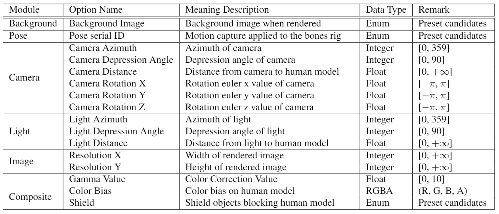

# TAGPerson-Blender
This repo contains the rendering codes of the paper `TAGPerson: A Target-Aware Generation pipeline for Person Re-identification`.

We use [BlenderPy](https://github.com/TylerGubala/blenderpy) to render images under parameterized control.

The training codes are in another project [tagperson-reid](https://github.com/tagperson/tagperson-reid), which uses PyTorhc to train the models.


## 1. Get Started

#### 1.1 Install Python Environment

Create the conda env:
```
conda create -n tagperson-blender python=3.7.10
conda activate tagperson-blender
```

Download the bpy wheel `bpy-2.91a0-cp37-cp37m-manylinux2014_x86_64.whl`, and then:
```
pip install bpy-2.91a0-cp37-cp37m-manylinux2014_x86_64.whl
```
Execute the post-processing command:
```
bpy_post_install
```

If encounter error:
```
Traceback (most recent call last):
  File "<stdin>", line 1, in <module>
ImportError: libXrender.so.1: cannot open shared object file: No such file or directory
```
You should switch to root user and install the lib.

On Ubuntu:
```
sudo apt-get install libxrender1
```

On CentOS:
```
sudo yum install libXrender.x86_64
```

**Note: install `bpy` by `pip install bpy` does not work for me.**

Since we use plugins for blender to load models from `MakeHuman`, we need to put some plugin codes into the library path.

Put the plugin `import_runtime_mhx2` and `makewalk` into the installation location of `bpy`, such as:
```
mv import_runtime_mhx2 makewalk ~/miniconda3/envs/tagperson-blender/lib/python3.7/site-packages/2.91/scripts/addons
```
The `bpy-2.91a0-cp37-cp37m-manylinux2014_x86_64.whl`, `import_runtime_mhx2` and `makewalk` can be download from the link described in `1.2 Prepare Data`


Install other python dependencies:
```
pip install -r requirements.txt
```

#### 1.2 Prepare Data

In order to prepare the blender rendering, we need to prepare necessary data in `data/` folder:
- `data/makehuman/makehuman_2954_mhx2_standing02`: 3D human models to render
- `data/bg_collection`: background images
- `data/pose`: pose structure json files
- `data/attribute_distribution`: The target-aware attribute_distribution information
- `data/shield_v2`: [Optional] The images used to create shield cases.

The `attribute_distribution` and `shield_v2` are optional. All names of these paths can be modified, as long as they are correctly specified in the configuration file.

You can download these data from [the link](https://drive.google.com/drive/folders/1eiFvsk78OqxerKSceRkORTlk5B7EB3ao).


## 2. Demo
Suppose the 3D human models have been downloaded to `data/makehuman` folder.

We can run a demo script to render one person to a static image:
```
PYTHONPATH=. python demo/01_render_one_person.py --mesh_path data/makehuman/makehuman_2954_mhx2_standing02/193_Standing02.mhx2 --save_path tmp/sample_person.jpg
```
The rendered image is saved to `tmp/sample_person.jpg`.


You can also run the script with `--demo_camera_azim` option to observe the changes in rendering option values:
```
PYTHONPATH=. python demo/01_render_one_person.py --mesh_path data/makehuman/makehuman_2954_mhx2_standing02/193_Standing02.mhx2 --save_path tmp/sample_person.gif --demo_camera_azim
```
The rendered animation image is saved to `tmp/sample_person.gif`.

You can specify different human models by the `--mesh_path` option.


## 3. Render Multiple Images

Ensure that the `data/makehuman/makehuman_2954_mhx2_standing02` folder exists, or create it by soft link:
```
ln -s data/makehuman/makehuman_2954_mhx2_standing02_mini data/makehuman/makehuman_2954_mhx2_standing02
```

To render a person ReID dataset, you can specific a config file and run:
```
PYTHONPATH=. python tools/batch_generate.py --config-file configs/TAGPerson/01_direct_transfer/tagp_base.yml
```

The images will be saved to the path specified in the `OUTPUT_DIR_FOR_IMAGE` config item.


If the 3D human models in the `data/makehuman/` folder are not complete, you can use `PROCESS.FIRST_INDEX` and `PROCESS.LAST_INDEX` to limit the range:
```
PYTHONPATH=. python tools/batch_generate.py --config-file configs/TAGPerson/01_direct_transfer/tagp_base.yml PROCESS.FIRST_INDEX 193 PROCESS.LAST_INDEX 193
```

## 4. Rendering Options
We describe parts of the rendering options below.



We visualize some effects of changing different values for certain rendering options.


Rendering options for each experiment can be found in the configure files in [this link](https://drive.google.com/drive/folders/1eiFvsk78OqxerKSceRkORTlk5B7EB3ao).


